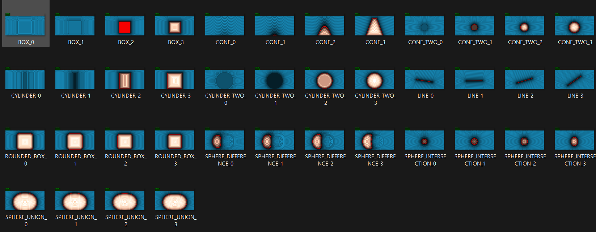

# Autograder for PA5, PA6

## Disclaimer
This autograder may not work perfect for several questions. In that case, please run it manually.
I checked that this works fine with PA5 1,2 and PA6 1~7.
Also change error threshold as you want.

## Usage
### Download files
Download and unzip files like this. `solution` includes solution folder.
```
PA5
└───student1
└───student2
└───student3
└───solution
```

### Create html files
Then, we need to create basic html file for each problem.
To do this by one-click, install following extension ([link](https://marketplace.visualstudio.com/items?itemName=rioj7.commandOnAllFiles)) on Visual Studio Code and assign ShaderToy command to commandOnAllFiles.

### Run code
Then run autograde code.
```
python main_PA5.py
```

Example output looks like this (PA5-1)
